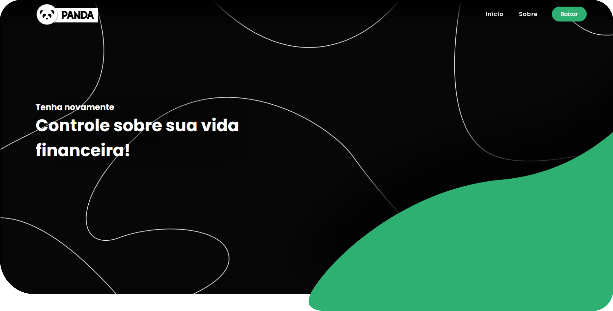

<!-- PROJECT LOGO -->
<h1 align="center">
 
  
 
 
Site Panda
</h1>

<!-- ABOUT THE PROJECT -->
## :bulb: Sobre o Projeto

Este projeto trata-se de um site em página única, para apresentar um aplicativo de organização financeira chamado Panda.

A intenção com este site é converter as visitas em downloads da aplicação.

<!-- TECHNOLOGIES -->
## :construction: Feito Com
Segue abaixo o que foi utilizado na criação deste aplicativo:

- :construction_worker: HTML
- :art: CSS
- :wrench: JavaScript

<!-- DEMONSTRATION -->
## :alembic: Demonstração
Para ilustrar melhor o projeto, abaixo estão algumas demonstrações:

### Tela inicial

### Navegando no site

<!-- CONTACT -->
## :speech_balloon: Contato
🔘 LinkedIn - [Clique Aqui](https://www.linkedin.com/in/vitormachado-code/)

